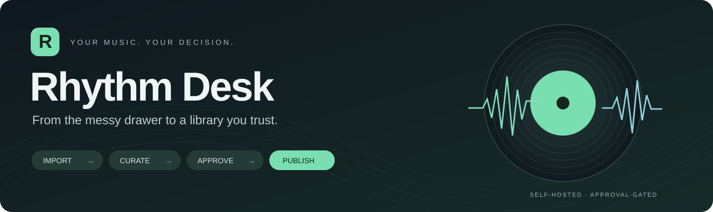
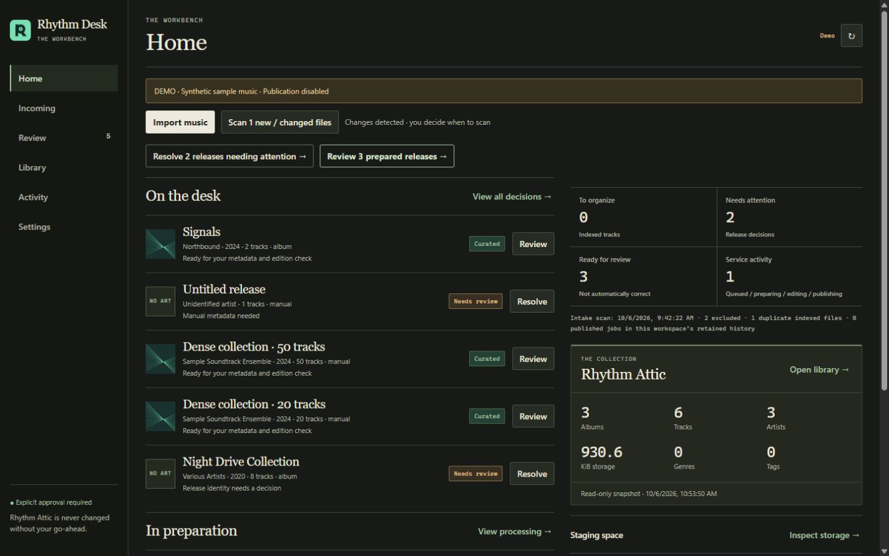
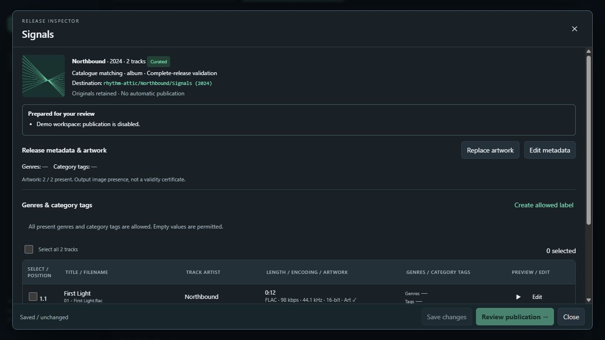
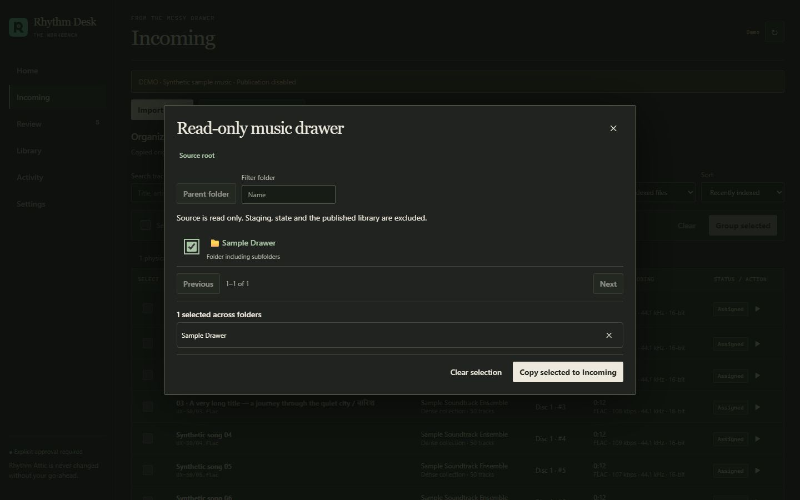
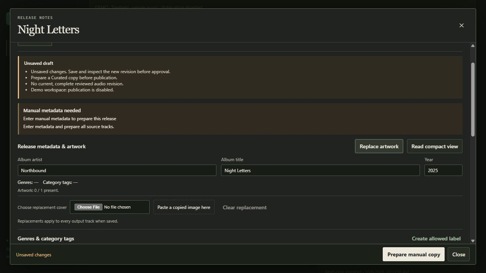
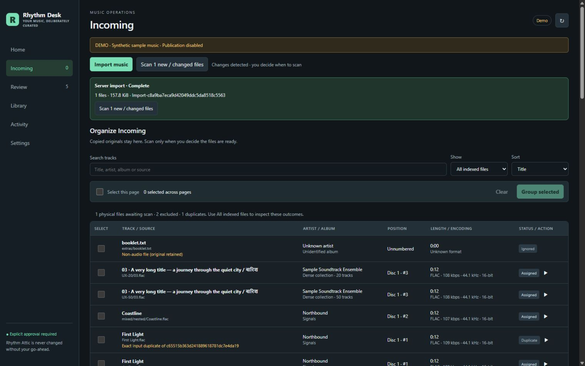
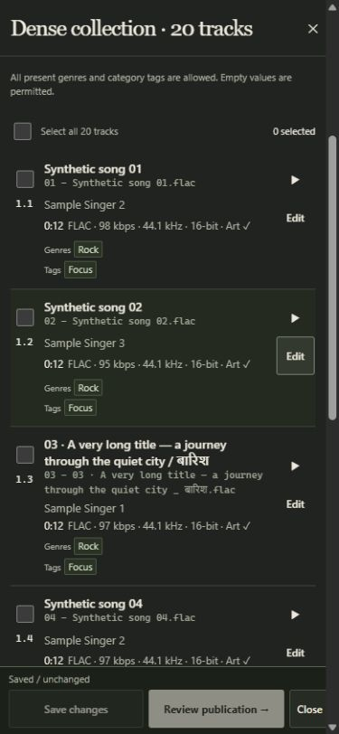
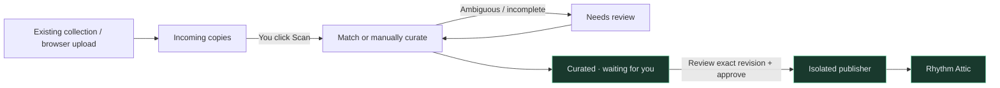

<p align="center"></p>

<p align="center">
  <a href="https://github.com/rajatsnvsingh/RhythmDesk/actions/workflows/tests.yml"></a>
  
  
  
</p>

<p align="center"><strong>A self-hosted review desk for the music you actually want to keep.</strong><br>Import messy collections. Match or manually curate. Inspect every release. Publish only when you say so.</p>

<p align="center"><a href="docs/user-guide.md">User guide</a> · <a href="docs/deployment.md">Deployment</a> · <a href="docs/architecture.md">Architecture</a> · <a href="docs/technical-spec.md">Technical specification</a></p>

## A calm desk for a messy collection

Rhythm Desk pairs **Beets, MusicBrainz and ffprobe** with a compact, data-rich web app. Loose songs, nested folders and mixed collections all enter the same review workflow. Acquisition stays separate: bring your existing files, or use your own acquisition tools.

Home puts decisions beside operational counts and library statistics. A warm, catalogue-inspired workbench gives release artwork and names room to breathe without burying the data. The unified Review desk keeps metadata, quality, artwork and labels visible, with compact phone rows and always-reachable Save / Review publication actions. One draft-aware editor handles corrections, manual metadata, searchable labels, selected-track batch edits and cover replacement. [UX overhaul and verification](docs/ux-overhaul.md).



*Screenshots use synthetic audio and sample artists in an isolated demo. No real library, credentials or private server addresses are shown. Demo publication is disabled.*

### What makes it useful

| Bring the mess | Make it yours | Keep the library sacred |
| :--- | :--- | :--- |
| Read-only server-side music drawer | Album, single and partial-release matching | Explicit approval for **every** release |
| Browser file/folder uploads and drag-and-drop | Manual metadata with pasted or chosen cover art | Original files retained during curation |
| Loose tracks and nested collections | Track titles, artists, year and numbering | Existing albums are never replaced |
| Detection without automatic scanning | Website-watermark cleanup before matching | Unapproved genres/tags block publication |
| Desktop and phone-friendly layouts | Audio previews and visible processing stages | Revision-bound approval and audit receipts |

## See the workflow

### Inspect before you approve

Review the proposed destination, embedded cover, track-level metadata and audio. Corrections create a new revision that must be reviewed again.



### Browse your existing collection without moving it

Select files or folders from a read-only host directory. Copies enter Incoming as a completed batch; your source stays untouched. **You choose when to Scan.**



### No catalogue match? Curate it yourself

Useful for soundtracks, regional releases and hard-to-match editions: enter the metadata, paste or choose a cover, and prepare a Curated copy. Manual mode does not certify completeness or bypass approval.



<details>
<summary><strong>More of the desk: incoming files and mobile review</strong></summary>



<p align="center"></p>

</details>

## The approval gate is the feature



Nothing publishes just because a match is high-confidence. The worker has **no final-library mount**; the web app reads the library; only the isolated publisher has a writable library mount.

Final output contains audio files only:

```text
rhythm-attic/
└── Album Artist/
    └── Album Title (2024)/
        ├── 01 - First Track.flac
        └── 02 - Second Track.flac
```

Artwork is embedded. Non-audio files and tracks shorter than 10 seconds are excluded from output, not silently deleted from the originals. Unsafe filename characters are sanitized. Genres and category tags must be explicitly allowed before publication.

## Get started

**Requirements:** Linux host, Docker Compose, Python 3 for bootstrap, and ACL tools. Check service UID/GID conflicts before provisioning.

```bash
git clone https://github.com/rajatsnvsingh/RhythmDesk.git
cd RhythmDesk
cp .env.example .env
```

1. Set a private random token, staging/state/library paths and the read-only `SOURCE_PATH` in `.env`.
2. Create a new empty library directory if starting fresh; run the [scoped bootstrap](docs/deployment.md#docker-setup).
3. Grant source read/traverse access to the UI identity only where needed.
4. Start the stack:

   ```bash
   docker compose up --build -d
   docker compose ps
   ```

The supplied Compose file binds to **localhost:8765**. Use an SSH tunnel, or deliberately configure a trusted LAN binding and allowed hosts. Keep plain HTTP off the public Internet. Phones must use the server's LAN address, not the phone's localhost.

Then: **import → Scan → inspect → correct labels → approve**. See the [illustrated user guide](docs/user-guide.md) for each screen, matching modes and recovery steps.

## Documentation

| Document | What you will find |
| :--- | :--- |
| [User guide](docs/user-guide.md) | Illustrated everyday workflow, artwork, matching modes, labels, mobile use and troubleshooting |
| [Deployment & operations](docs/deployment.md) | Docker, identities, mounts, authentication, restricted updates, backups and purge precautions |
| [Architecture](docs/architecture.md) | Trust boundaries, component responsibilities, state transitions and publication sequence diagrams |
| [Technical specification](docs/technical-spec.md) | Storage contracts, configuration, API map, validation, limits and known constraints |
| [Screenshot notes](docs/screenshots.md) | Demo provenance and how to refresh the screenshots |

## Development

Use Python 3.12+, install `requirements.txt`, and make `ffmpeg`/`ffprobe` available:

```bash
python -m pip install -r requirements.txt
python -m unittest discover -s tests
```

The test suite uses tiny synthetic audio fixtures. GitHub Actions runs the suite on Linux. Keys, `.env`, local runtimes, audio, databases, logs and deployment backups must stay out of commits.

**Current scope:** a single-user curation desk, not a music acquisition client, multi-user platform or automatic library replacer. Released under the [MIT License](LICENSE).
