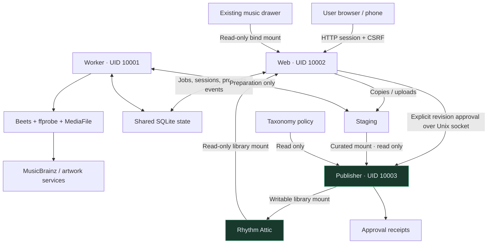
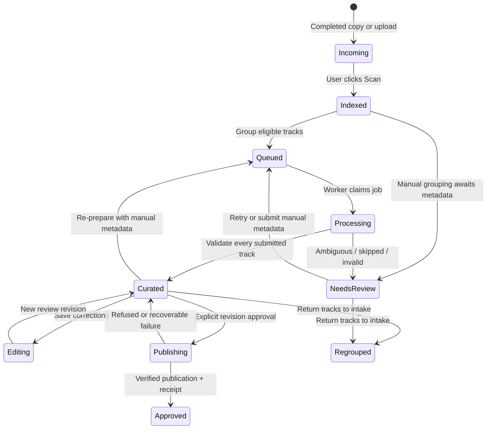
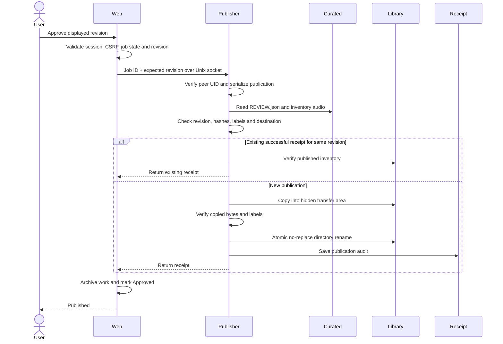
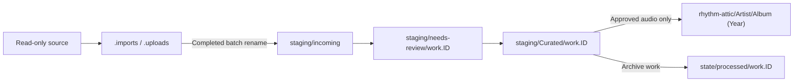

# Architecture overview

[Documentation index](README.md) · [Technical specification](technical-spec.md) · [Deployment](deployment.md)

Rhythm Desk separates preparation from publication. Match confidence determines whether a working copy is ready for review; it never authorizes a library write.

## Components and trust boundaries

| Component | Responsibilities | Intentionally absent |
| --- | --- | --- |
| Web | Browser UI, authenticated APIs, browsing/copying the drawer, uploads, review/editing, approval requests, read-only library statistics | Writable library mount; Docker socket |
| Worker | Manual-triggered scanning, grouping, checking originals, automatic/manual preparation, progress and review records | Final-library mount; publisher socket |
| Publisher | Verify caller, revision, audio inventory and label policy; publish without replacement; record receipt | External network access; general source-drawer access |
| Shared state | SQLite jobs/tracks/events/meta/sessions, taxonomy, processed work, receipts | An authorization to publish simply because a job is Curated |

Containers are non-root, drop capabilities, use read-only root filesystems and `/tmp` tmpfs. Linux ACLs and bind mounts provide different layers: read-only Docker mounts do not grant host permission, and writable app mounts do not confer general server access.

## Lifecycle

`Incoming`/`Indexed` in this diagram summarize intake behavior; actual track statuses include Incoming, Unresolved, Assigned, Duplicate, Ignored, Superseded and Approved. Job statuses are persisted separately. Startup marks interrupted Processing/Editing jobs Needs review rather than pretending they completed.

## Preparation pipeline

1. A user-requested Scan fingerprints inspected files by size/mtime and, for readable audio, SHA-256. Repeated scans of unchanged input are skipped; there is no intake settling timer.
2. Grouping uses source metadata, or an explicit user selection. One worker claims queued jobs transactionally.
3. Verify original checksums and copy into per-job originals/input directories. Never tag the incoming original.
4. Automatic mode cleans website watermarks in input tags and runs strict Beets matching. Single/partial modes resolve matched recordings to an intended release. Manual mode applies user metadata without catalogue queries.
5. Normalize filenames, validate output count and required tags, and calculate a review revision over destination, hashes and track metadata (including mode).
6. Move the completed working directory to Curated. Report unknown labels, then wait.

Progress is durable metadata rather than inferred from UI timers. Counts are meaningful during per-track operations; network stages have no manufactured percentage.

## Publication protocol

No-replace publication is the key safety property. An existing destination is an error, not an invitation to merge or overwrite. The hidden transfer is on the library filesystem so the final transition can be atomic. UI archival can cross Docker bind mounts; its copy-and-verify fallback retains a recovery source.

## Filesystem ownership

Staging maintenance coordinates through shared activity/maintenance locks. Purge removes staging content, not the library or processed state archives. This is not a backup system: operators should back up state and music independently.

## Deployment authority is separate

The optional restricted SSH account accepts only `deploy` and `status`. A root-owned helper validates a source-only archive and rebuilds a fixed stack using administrator-pinned configuration. It cannot provide an interactive shell, change mounts or upload arbitrary build configuration.

This scope is **not** a sandbox against malicious app code: deploying publisher code can affect music in the publisher's existing mounts. Keep keys private, review changes and revoke temporary deployment access when appropriate.

## Current limitations

Single-user operation, shared SQLite state and one serialized curation worker favor a small homelab deployment. MusicBrainz coverage and network availability affect automatic matches. Manual curation handles gaps but cannot certify catalogue correctness or completeness. There is no built-in acquisition, library replacement, transcoding requirement, remote mount manager or multi-user role system.
