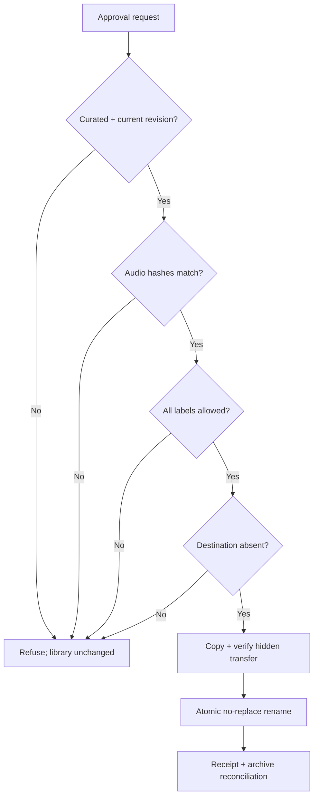

# Technical specification

[Documentation index](README.md) · [Architecture](architecture.md) · [User guide](user-guide.md)

This document describes implemented behavior. Paths below are container paths unless marked host paths. Review the source/configuration when changing security-sensitive behavior; this is not a formal security audit.

## Runtime and deployment contract

Python 3.12+, Beets 2.14.1, Pillow 11–12, ffmpeg/ffprobe and MediaFile/Mutagen through the Beets dependency tree. The web service uses Python's threaded HTTP server, SQLite and static HTML/CSS/JavaScript; no frontend build step or separate database service is required. Linux is the intended service platform.

Three Compose services use the same image with distinct commands and identities:

| Service | Default UID:GID | Entry point | Network |
| --- | --- | --- | --- |
| worker | 10001:10000 | `app/worker.py` | Curator network; catalogue/art access |
| web | 10002:10000 | `app/server.py` | Curator network; port 8765 |
| publisher | 10003:10000 | `app/publisher.py` | `network_mode: none`; Unix socket |

Mounts are the library-write boundary. Worker has writable staging/state but no library/socket. Web has writable staging/state, read-only source/library/socket mounts and read-only receipts. Publisher receives read-only Curated/taxonomy, writable receipts/library/socket. Bootstrap supplies scoped host ACLs and non-login accounts; shared state files must remain group-writable.

## Configuration

| Setting | Default/example | Contract |
| --- | --- | --- |
| `STAGING_PATH` | `/srv/media/music/staging` in `.env.example` | Host writable workspace; Incoming is its `incoming` subdirectory |
| `STATE_PATH` | `/srv/media/music/curator-state` | Host database, sessions, taxonomy, audit and archives |
| `LIBRARY_PATH` | `/srv/media/music/rhythm-attic` | Required final destination; pre-create before bootstrap |
| `SOURCE_PATH` | `/srv/media/music` | Read-only source mounted at `/mnt/music-source` in web |
| `UI_PORT` | `8765` | Host port; supplied Compose binds to 127.0.0.1 |
| `WORKER_UID`, `UI_UID`, `PUBLISHER_UID` | 10001 / 10002 / 10003 | Must agree with host account/ACL provisioning |
| `CURATOR_AUTH_REQUIRED` | `1` | Token authentication; `0` is supported but discouraged outside isolated local demo |
| `CURATOR_UI_TOKEN` | Private random value | At least 24 characters; placeholder is rejected |
| `CURATOR_ALLOWED_HOSTS` | `127.0.0.1,localhost` | Host header allow list; add intended LAN/reverse-proxy hostname |
| `CURATOR_SECURE_COOKIE` | `0` | Set to `1` when the browser-facing service uses HTTPS |

Runtime settings include scan interval, automatic grouping and pause. Scanning remains user-requested. A saved directory plan does not apply Docker mounts. Source Settings persists a relative subfolder inside the fixed source mount; it cannot select arbitrary server paths. Host/source mounts require administrator recreation.

## Persistent data

| Store | Important fields / purpose |
| --- | --- |
| `tracks` | ID, relative source path, size/mtime signature, SHA-256, intake status/reason, audio metadata/quality, job ID |
| `jobs` | ID, status, matching mode, artist/album/year, release UUID, reason, revision, destination, count, timestamps |
| `events` | Timestamp, level, job ID and action message |
| `meta` | Runtime controls, scan request/detection, heartbeat, library snapshot, source-import state, manual payload, progress |
| `web_sessions` | Hashed session identifier, CSRF value, expiration and token-derived credential marker |
| `taxonomy/allow-list.json` | Global genre and category-tag allow lists |
| `approvals/work.ID.json` | Successful publication receipt |

SQLite runs in WAL mode with a 30-second connection timeout. `BEGIN IMMEDIATE` claims critical state transitions. Startup adds the `jobs.mode` column if missing. File operations and SQLite updates are not one distributed transaction; review receipts and archival reconciliation are recovery mechanisms, not a guarantee against every crash point.

### Working directory

```text
staging/
├── incoming/                 # retained originals and completed batches
├── .uploads/                 # unpublished upload batches
├── .imports/                 # unpublished server-copy batches
├── needs-review/work.ID/
│   ├── originals/            # checksum-verified original copies
│   ├── input/                # disposable tagged matching input
│   ├── audio/                # generated output, possibly incomplete
│   ├── SOURCES.json
│   └── BEETS.log
└── Curated/work.ID/
    ├── audio/Artist/Album (Year)/NN - Title.ext
    ├── REVIEW.json
    └── ...                   # original copies, logs, edit history
```

Manual work also records `MANUAL.json`. Per-job Beets configuration/database and previous-edit audio directories live with the work. These support investigation but are not copied into the final album.

## Validation and matching

- Supported audio extensions: `.flac`, `.mp3`, `.m4a`, `.aac`, `.ogg`, `.opus`, `.wav`, `.aiff`, `.alac`, `.aif`. Extension alone is insufficient: ffprobe must find readable audio with positive duration and MediaFile must read metadata.
- Under-10-second tracks and non-audio files are excluded. Originals are retained until explicit staging purge.
- SHA-256 checks reject changes between scan and preparation; timestamp-only changes to the sole original are reconciled without self-duplication.
- Production Beets configuration uses quiet imports, fallback skip and strong recommendation threshold `0.03` (a lower distance is better). Missing/unmatched tracks cap the recommendation at medium. Confidence never authorizes publication.
- Single/partial modes use recording matching, then verify unique recording membership in the selected/unambiguous release. Every submitted eligible track must appear in generated output.
- Website cleanup recognizes explicit `http(s)`/`www` links and supported domain patterns in title/album/artist/albumartist. It is heuristic, not a general semantic metadata cleaner. Dotted names such as `will.i.am` remain intact. Changes are logged and originals are not retagged.
- Manual metadata requires non-empty album/artist/title fields, a 1000–9999 year, positive disc/track positions and no duplicate positions. It bypasses catalogue queries, not validation or approval.
- Output is one artist/album-year directory. Filenames are sanitized, numbered globally across discs and normalized with lowercase extensions. Metadata disc/track positions are retained.

## Artwork and labels

Usability checks decode image bytes rather than trusting a tag's presence. If every input has usable art, automatic fetching/embedding is disabled for that release unless explicitly forced. Otherwise downloaded artwork is applied to output through Beets fetchart/embedart. A forced-art retry still requires successful matching.

Manual artwork accepts base64 image bytes, at most 10 MiB and 20 megapixels. Pillow decodes and normalizes them to RGB JPEG, maximum 1600×1600 bounds. A selected cover replaces images in every output track. Without a selected cover, each track retains its usable existing image, if any.

Genres use the media genre fields. Category tags use semicolon-separated grouping labels. Values are trimmed, deduplicated case-insensitively and bounded to 100 labels, each at most 100 characters with no control characters. Non-empty unknown values block publication; changing a global allow list does not publish or automatically apply labels.

## Review and publication contracts

`REVIEW.json` records destination, audio hashes, track metadata, prepared timestamp and revision. Revision is SHA-256 over a canonical JSON representation of destination, hashes, tracks and matching mode when present. Manual tracks carry source identity for repeat editing.

Editing operates on a temporary audio copy, renormalizes output and records a new revision. Existing working audio is retained as edit history. Publication requires the current Curated revision, unchanged audio and an allowed taxonomy. Destination collisions fail without replacement. The publisher serializes requests and checks the Unix peer UID against the configured UI identity.



A same-revision successful receipt supports idempotent retries after rechecking published inventory. A different revision or externally changed published album requires administrator investigation.

## HTTP API map

All API routes require a session except sign-in and session bootstrap. Mutating routes validate origin/host and CSRF. JSON is required unless the upload endpoint specifies binary bytes.

| Area | Routes |
| --- | --- |
| Session | `GET /api/session`; `POST /api/login`, `/api/logout` |
| Inventory | `GET /api/snapshot`, `/api/jobs/{id}`, `/api/media` |
| Intake | `POST /api/intake/scan`, `/api/group` |
| Release actions | `POST /api/jobs/{id}/retry`, `/ungroup`, `/edit`, `/manual`, `/approve` |
| Drawer | `GET /api/source`, `/api/source/import`; `POST /api/source/import` |
| Upload | `POST /api/uploads/file?batch=…&path=…` (binary), `/api/uploads/complete` (JSON) |
| Settings | `GET /api/settings`, `/api/settings/paths.env`; `POST /api/settings/runtime`, `/paths`, `/source` |
| Labels | `GET/POST /api/taxonomy`; `POST /api/taxonomy/allow` |
| Maintenance | `GET /api/staging`; `POST /api/staging/purge`, `/api/stats/refresh` |

Grouped route suffixes such as `/edit` above extend `/api/jobs/{id}`. Snapshot supports offset/limit/search/status; drawer listing paginates by 200 entries and filters the current directory. Source imports expose status/count/bytes and publish a complete batch to Incoming via rename.

Media serving supports byte ranges, including suffix requests; valid ranges return 206, invalid ranges 416. `art=1` returns usable embedded artwork, not an arbitrary file path.

## Limits and timing

| Operation | Limit / interval |
| --- | --- |
| Group selection | 1–1,000 eligible tracks |
| Drawer selection | 1–1,000 selected paths; one Copying import at a time |
| Copy/upload batch | 10,000 regular files / 50 GiB |
| Browser upload file | 2 GiB default (`CURATOR_UPLOAD_FILE_BYTES` override) |
| Manual image | 10 MiB / 20 megapixels |
| JSON body | 512,000 bytes normally; 16 MiB for manual submission |
| ffprobe | 90-second per-file timeout |
| Beets import | 1,800-second timeout |
| Recording-release requests | 60-second HTTP timeout; approximately 1.05 seconds between lookups |
| UI refresh | Normally 8 seconds; active Processing jobs additionally poll every 2 seconds |
| Session | 12 hours; token rotation invalidates existing credentials |

## Security and operations

Sessions use HttpOnly SameSite=Strict cookies; secure cookies are configurable for HTTPS. Hashed identifiers persist across restarts. Login attempts are rate-limited per client IP. Host/origin checks and a content security policy complement the authentication layer. These controls do not turn the built-in HTTP server into an Internet-facing hardened gateway.

Relative path validation rejects traversal and symlinks. Source browsing excludes configured operational paths and conventional staging/state/library directory names. Host directory permissions and read-only mount enforcement remain necessary.

The optional deployment helper accepts only source files (`.py`, `.js`, `.css`, `.html`) under `app/`, bounded to 500 entries / 20 MiB uncompressed. Build files, dependencies, `.env`, Beets config and Compose are administrator-pinned. Documentation/assets are versioned in Git, not sent through this source-only deployment channel.

Staging purge uses confirmation plus maintenance/activity locks and retains library/processed archives. It is permanently destructive within staging. Do not concurrently upload through SMB or manually alter directories during purge.

## Verification and extension points

Run `python -m unittest discover -s tests`. Coverage includes real tiny audio, Beets copy imports, manual artwork/tagging, original preservation, watermark cleanup, mode behavior, revision changes, taxonomy, source/upload safety, HTTP authentication/ranges, archival and deployment archive checks.

Changes to publishing, paths or revisions should extend these tests first. Keep new processing operations confined to working copies; add progress updates without exposing raw credentials; retain explicit revision-bound approval as the only normal publication path.
